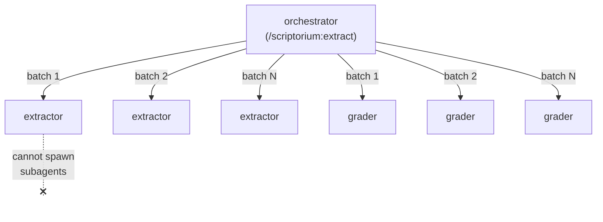
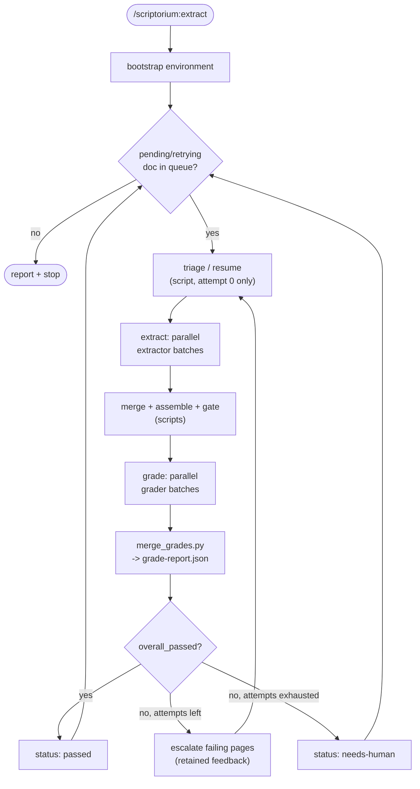
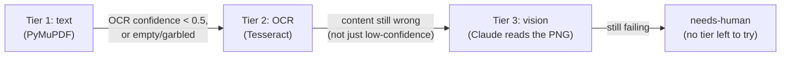

# Architecture — the loop

This document covers the elastic loop itself: why the agent tree has the
shape it does, how the orchestrator drives a document through it, and how
failures turn into targeted retries. For the skills/scripts/schemas that
implement each step, see [`tooling.md`](tooling.md).

## Elastic Loop mapping

> Intent opens the loop. Context grounds it. Backpressure keeps it useful.
> Verification closes it.

| Elastic Loop concept | This plugin |
|---|---|
| Intent opens the loop | `/scriptorium:extract` sets doc (or the whole `input/` queue), format, `--batch-size`, `--max-attempts` |
| Context grounds it | the PDF, per-page rendered PNGs, per-page shards |
| Backpressure (structural/hard) | `grade-output`'s `gates.py` — page count, empty pages, dangling asset refs, OCR confidence floor |
| Backpressure (product/soft) | `grade-output/rubric.md` — reading order, dropped/hallucinated/duplicated text, table integrity, headings, captions. Pass threshold (0.85) is hardcoded there, not a CLI flag |
| Verification closes it | the `grader` role — independent of `extractor`, never grades its own work |
| Loop sizing | `pdf-triage` classifies each document `loose` (all tier-1) or `tight` (needs escalation) |
| Elastic escalation | Tier 1 text (PyMuPDF) → Tier 2 OCR (Tesseract) → Tier 3 vision (Claude) |
| Retained feedback | a failed grade's per-page failure taxonomy drives exactly which pages escalate to which tier on retry — not a blind re-run |
| Harness engineering | environment bootstrap, page sharding, and the context-rot rule below — the loop only works if the scaffold around the model is sound |

## The two-level agent tree (why there are only two agent *roles*)

Claude Code subagents are a two-level tree: the orchestrator (root) spawns
subagents, but a subagent **cannot spawn its own subagents**. So the
orchestrator is the only spawner, and `extractor`/`grader` are **roles it
spawns many times in parallel**, once per page batch of a document — not
five different specialist agents taking turns. Specialization still exists;
it just lives in the *skills* each role calls (text vs. OCR vs. vision vs.
images), not in five separate agent identities.

## Context-rot prevention

Each `extractor`/`grader` subagent has its own isolated context window. Page
images, full element lists, and raw script output all stay inside the leaf
that produced them; only a compact summary comes back to the orchestrator.
The orchestrator's own context stays small no matter how many pages or how
many retries a document takes — it reads script stdout (paths/counts) and
`grade-report.json`/`state.json`, never bulk content. If the orchestrator is
ever about to `Read` a page image or `elements.json` directly, that's a bug:
that's a subagent's job.

## The orchestrator queue loop

`commands/extract.md` (`/scriptorium:extract`):

1. **Bootstrap** the environment once (`setup-environment`), before the queue
   loop starts.
2. **Pick** the next document with `status` `pending` or `retrying` from
   `runs/state.json`. None left → report and stop.
3. **Triage / resume** — attempt 0 runs `pdf-triage` (pure classification, no
   agent needed); a retry reuses `escalated_pages` from state instead of
   re-triaging. If any page needs OCR/vision and the document's OCR language
   hasn't been resolved yet, resolve it once via `ensure_language.py`.
4. **Extract — parallel batches**: partition the pages to (re-)extract
   (all pages on attempt 0, only `escalated_pages` on retry) into
   `--batch-size` groups, and spawn one `extractor` subagent per group **in a
   single message** so they run in parallel. Each writes only its own pages'
   shards — race-free by construction.
5. **Merge and assemble** (deterministic scripts, not agents): `merge.py` →
   `assemble.py` → `gates.py`. `merge.py` recombines every page's shards, old
   and new, so a retry that only touched 2 pages still produces a complete
   document.
6. **Grade — parallel batches**: same page-set rule as extraction, one
   `grader` subagent per batch, spawned in parallel, each judging the
   assembled output against the rendered pages. `merge_grades.py` combines
   every batch's shards into `grade-report.json`.
7. **Decide**: `overall_passed` (gates AND rubric) → `passed`, next document.
   Otherwise escalate (below), `status: retrying`, loop back to step 4 — or,
   at `max-attempts`, `status: needs-human`.

## The escalation ladder and retained feedback

Body extraction has three tiers: **Tier 1 text** (PyMuPDF, cheap,
deterministic) → **Tier 2 OCR** (Tesseract, local) → **Tier 3 vision**
(Claude reading the rendered page directly). A document is only as expensive
as it needs to be: `pdf-triage` starts every page at the cheapest tier that
should work, and only a failed grade bumps a page up.

When a grade fails, the grader's per-page failure taxonomy — not a blind
re-run — decides what happens next:

| Failure tag | Effect on retry |
|---|---|
| `dropped_text`, `hallucinated_text`, `wrong_reading_order`, `duplicated_text`, `wrong_heading_level`, `table_corruption` | bump that page's body tier one step (`text → ocr → ocr → vision`; a page already at `ocr` whose *content* is wrong, not just low-confidence, jumps straight to `vision`) |
| a page already at `vision` still failing | don't retry again — `status: needs-human` for the whole document immediately |
| `missing_image`, `bad_caption` | body tier unchanged; set `recheck_images: true` so the next `extractor` batch redoes just the image step |

Each escalation records the grader's actual `reason` text alongside it in
`runs/state.json` — that's what makes this retained feedback instead of a
blind retry, and what the next `extractor` batch is told directly.

## Why shards, not one shared file

An earlier version had every extraction script read-modify-write one
`elements.json` per document — a lost-update race under concurrency, since
two parallel writers can silently clobber each other's pages. Now every
extractor/grader subagent **writes only its own page(s)' shard files**
(`work/<doc>/shards/page{N}.{text|ocr|vision|image}.json`,
`output/<doc>/grade-shards/page{N}.json`) and never reads or touches another
page's or another batch's shard. Two deterministic scripts (`merge.py`,
`merge_grades.py`) combine everything afterward — no locking needed, because
nothing is ever shared while it's being written.
